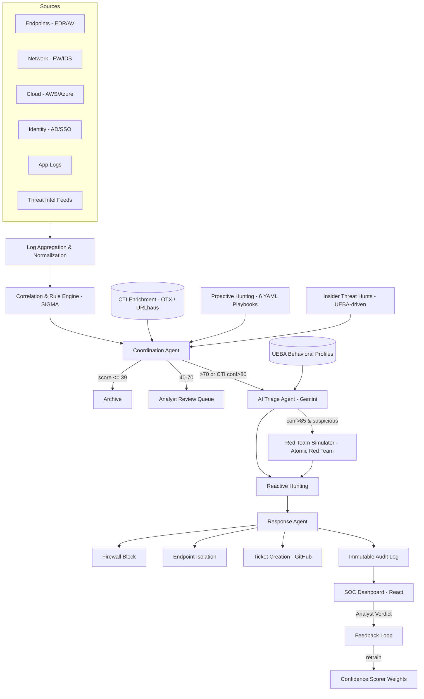

# Cosmic Security Operations Platform

### Agentic SIEM, Threat Detection & Automated Response

A security operations platform engineered for **Cosmic Info Solutions**, extending Wazuh + Elastic with an agentic AI layer for threat intelligence enrichment, alert triage, proactive threat hunting, UEBA, automated response, red-team validation, and multi-tenant SOC operations.

**Engineer:** Ahmad Bussti
**Development:** ~10 weeks across Phases 1–4, ongoing
**Status:** Core detection, response, API gateway, and multi-tenant capabilities implemented and validated against a live Wazuh/Elastic environment.

---

## 1. Overview

Traditional SIEM platforms are effective at collecting telemetry, applying detection rules, and generating alerts. The larger operational challenge is what happens after an alert is created.

I engineered a security-operations layer around Wazuh and Elastic to extend the platform beyond detection into:

**Detection → Context → Triage → Investigation → Validation → Response → Feedback**

The platform combines deterministic security controls with AI-assisted analysis, threat intelligence, behavioral analytics, automated response, and controlled offensive validation.

### Key capabilities

* Live threat intelligence enrichment
* Explainable confidence scoring
* AI-assisted alert triage
* Proactive threat hunting
* UEBA behavioral profiling
* Insider-threat detection
* Automated response through Wazuh
* Controlled Atomic Red Team validation
* Multi-tenant isolation
* JWT/RBAC API security
* Tenant onboarding automation
* Compliance evidence and reporting
* Custom SOC dashboard
* Secure HTTPS telemetry ingestion

---

## 2. Engineering Focus

The project was not limited to deploying Wazuh and configuring detection rules.

A major focus was identifying limitations in the underlying security stack and engineering additional components around them.

Examples include:

* Building a custom endpoint-isolation response mechanism
* Engineering tenant isolation at multiple layers
* Debugging and correcting live UEBA data-quality issues
* Building an API gateway with authentication, RBAC, rate limiting, and tenant scoping
* Integrating CTI into the alert-processing pipeline
* Designing safe red-team validation workflows
* Creating deterministic fallbacks for AI service failures
* Building proactive hunting pipelines independent of existing SIEM alerts
* Developing a secure external ingestion gateway
* Validating the platform against live Wazuh/Elastic infrastructure

This makes the project less about **deploying a SIEM** and more about **engineering a security operations platform around an existing SIEM foundation**.

---

## 3. Architecture



---

## 4. Detection & Investigation Pipeline

The platform separates the initial security detection layer from the downstream investigation and response process.

### Reactive workflow

1. Security telemetry enters Wazuh/Elastic.
2. Correlation and SIGMA-style detections identify suspicious activity.
3. The coordination agent evaluates the finding.
4. CTI enrichment adds external threat context.
5. A transparent confidence score is calculated.
6. Higher-confidence findings are passed to AI triage.
7. UEBA context is incorporated into the investigation.
8. Suspicious high-confidence findings can trigger controlled red-team validation.
9. Reactive hunting gathers additional evidence.
10. The response agent executes an approved action.
11. The activity and response are written to the audit trail.
12. Analysts review the finding and provide a final verdict.

### Proactive workflow

The platform also operates independently of existing alerts.

Scheduled hunting playbooks and UEBA-driven insider-threat hunts can identify suspicious behavior and inject their findings into the same downstream coordination pipeline.

This creates two paths into the SOC:

**Existing detection → investigation**

and

**Proactive hunting → investigation**

---

## 5. Core Security Capabilities

### Threat Intelligence Enrichment

Every relevant alert can be enriched against live CTI sources:

* AlienVault OTX
* Abuse.ch URLhaus

The current environment has been tested against **23,937 IOC records**.

Confirmed matches can provide additional context such as:

* Threat actors
* Campaigns
* Associated TTPs
* Target sectors
* Indicator confidence

---

### Confidence Scoring

Instead of relying exclusively on the original SIEM severity, the platform calculates an additional confidence score.

Signals currently include:

* Base severity
* After-hours activity
* New source IP
* CTI match
* Event/traffic volume
* UEBA anomaly

The additive model makes the score explainable because individual contributing signals can be inspected.

---

### AI-Assisted Triage

The triage agent uses **Gemini 2.5 Flash** to evaluate alert context and produce structured findings.

The analysis can incorporate:

* Detection metadata
* CTI results
* UEBA anomalies
* Traffic/event volume
* Threat context
* MITRE ATT&CK information

The resulting assessment includes a verdict, confidence, technique mapping, and investigation reasoning.

AI is treated as an **analyst-assistance layer**, not as authoritative evidence.

If the model provider becomes unavailable, deterministic fallback logic prevents the security pipeline from failing.

---

## 6. UEBA & Insider Threat Detection

The platform builds behavioral profiles for users and hosts.

Baseline dimensions include:

* Login times
* Source IP history
* Command patterns
* Outbound activity
* Peer-group behavior

Four UEBA-driven hunts are currently implemented:

| Hunt                | Detection Focus                                  |
| ------------------- | ------------------------------------------------ |
| Credential Hoarding | Suspicious accumulation or access to credentials |
| Data Staging        | Unusual preparation of data for transfer         |
| Access Broadening   | Sudden expansion of resource access              |
| Schedule Shift      | Significant deviation from normal activity hours |

A major engineering challenge was ensuring that **missing telemetry was not interpreted as normal behavior**.

Several live data-quality issues were identified and corrected, including incorrect query scoping, username-format mismatches, aggregation bucket conflicts, and ambiguity between zero values and missing fields.

The implementation now exposes coverage state explicitly rather than silently treating unavailable data as a low-risk result.

---

## 7. Proactive Threat Hunting

Six YAML-defined hunting playbooks currently operate independently of standard alert generation.

Coverage includes:

* Lateral movement
* Data exfiltration
* Additional exfiltration behavior
* LOLBin activity
* Persistence
* Beaconing

The hunting layer uses aggregation and seven-day behavioral baselines to identify deviations.

Findings are converted into synthetic alerts and passed into the common SOC workflow.

This means proactive hunts can benefit from the same:

**Scoring → CTI → AI triage → Investigation → Response**

pipeline as traditional SIEM detections.

---

## 8. Automated Response

The response layer connects investigation findings to controlled security actions.

Current capabilities include:

* Firewall IP blocking
* IP unblocking
* Endpoint isolation
* Ticket creation
* Immutable response auditing

### Custom Endpoint Isolation

The standard Wazuh response mechanisms did not provide the required isolation behavior.

I therefore developed a custom `isolate-host` response script using:

* Dedicated iptables chain
* Wazuh manager allow-list
* Default-deny behavior
* Reversible rules
* Audit logging

The implementation allows a host to be isolated while maintaining the required management path back to the Wazuh infrastructure.

---

## 9. Red-Team Validation

The platform integrates **Atomic Red Team** to validate selected detections against disposable isolated targets.

The purpose is not simply to simulate attacks, but to answer:

> **Can the detection and response pipeline actually observe and handle the behavior it claims to detect?**

The validation process is deliberately controlled:

1. Technique identified
2. Test reviewed
3. Allow-list checked
4. Human approval required
5. Disposable target selected
6. Test executed
7. Detection observed
8. Response validated

Testing is dry-run by default where applicable.

One proposed test was rejected after its execution path introduced an unnecessary supply-chain risk through an unpinned `curl | bash` workflow.

Currently validated coverage includes **T1082**, while additional techniques remain gated pending further safety review.

---

## 10. Multi-Tenant Security

The platform was designed to support multiple customer environments with tenant isolation enforced at the security boundary.

Isolation is implemented through two independent controls:

1. Index-level separation
2. Document-level `tenant_id` filtering

Requests without valid tenant context fail rather than falling back to unrestricted access.

The implementation has been tested with concurrent data from multiple tenants, with **zero observed cross-tenant leakage in the tested scenarios**.

### JWT & RBAC Gateway

The FastAPI gateway provides:

* JWT authentication
* Admin / Analyst / Viewer roles
* Tenant-scoped access
* Per-role rate limiting
* Audit logging
* API key management

---

## 11. Tenant Onboarding

The platform includes a self-service onboarding API designed to reduce manual setup when adding a new customer.

The onboarding process can provision:

* Tenant-specific indexes
* API credentials
* Default SIGMA detections
* Enrollment tokens
* Initial security configuration

This allows tenant provisioning to become part of the platform rather than a manual infrastructure task.

---

## 12. Secure Ingestion Gateway

A dedicated HTTPS ingestion gateway provides an external entry point for customer telemetry.

```text
Customer
   │
   │ HTTPS + API Key
   ▼
Caddy / FastAPI Gateway
   │
   ▼
Tenant Authentication
   │
   ▼
Raw Payload Staging
   │
   ▼
Wazuh / Elastic Pipeline
```

The gateway provides:

* TLS-protected ingestion
* Tenant-specific API keys
* Raw payload preservation
* Tenant-scoped processing
* External/internal separation

During implementation, infrastructure issues involving port conflicts, systemd environment paths, and Caddy TLS hostname configuration were identified and resolved.

---

## 13. SOC Dashboard

The React-based dashboard provides a centralized analyst interface.

Current functionality includes:

* Live alert feed
* WebSocket updates
* MITRE ATT&CK heatmap
* Confidence distribution
* Analyst workbench
* Entity risk timelines
* Management KPIs
* Investigation context
* Response status

The objective is to provide analysts with the context required to investigate an alert without constantly switching between separate systems.

### Screenshots

Add your strongest screenshots here:

```markdown


```

---

## 14. My Engineering Contributions

The following areas represent the main engineering work completed during development.

### Wazuh Active Response

Investigated a Wazuh REST API limitation affecting stateful active-response reversal and implemented an SSH-based reversal path compatible with the existing response mechanism.

### Custom Host Isolation

Designed and implemented the `isolate-host` response mechanism using a dedicated iptables chain, management allow-list, and default-deny behavior.

### Multi-Tenant Security

Implemented tenant isolation at multiple layers and performed adversarial concurrent-tenant testing to identify potential cross-tenant access paths.

### UEBA Debugging

Root-caused four live UEBA data-quality problems involving:

* Query scoping
* Username normalization
* Aggregation types
* Missing versus zero-valued telemetry

### AI Reliability

Implemented deterministic fallback behavior so external LLM failures do not bring down the security-processing pipeline.

### Security Scoring

Designed an additive confidence model where individual signals remain visible and auditable instead of hiding the decision behind an opaque score.

### API Security

Built the FastAPI security gateway with:

* JWT authentication
* RBAC
* Rate limiting
* Tenant-scoped queries
* Audit logging
* Customer onboarding

### External Ingestion

Built the TLS-protected ingestion gateway and investigated infrastructure-level issues involving ports, systemd, and Caddy.

### Red-Team Safety

Established a human-in-the-loop validation model and rejected unsafe Atomic Red Team execution paths when their implementation introduced unnecessary risk.

---

## 15. Validation

Testing has been performed against the project's live Wazuh/Elastic environment.

Validated areas include:

* Detection pipeline execution
* CTI enrichment
* Confidence scoring
* UEBA processing
* Proactive hunting
* Wazuh active response
* Endpoint isolation
* Multi-tenant isolation
* Concurrent tenant access
* JWT/RBAC enforcement
* Rate limiting
* HTTPS ingestion
* Atomic Red Team validation
* Report generation
* LLM failure handling

Where functionality remains incomplete or gated, it is explicitly documented below.

---

## 16. Known Limitations

The platform remains an active engineering project.

### Confidence Model

Retrained scoring weights are currently generated and validated but are **not yet wired into the live scorer**.

### Red-Team Coverage

Several Atomic Red Team techniques remain gated pending additional safety review and suitable isolated infrastructure.

### Endpoint Isolation

The custom isolation mechanism is implemented and tested, but broader automated deployment remains controlled.

### Elastic Licensing

Some Kibana drilldown functionality is limited by the available Elastic license tier.

### Webhook Logging

A known Elasticsearch field-mapping issue can produce an incorrect failed-delivery log even when external delivery has been independently confirmed.

### TLS

The external ingestion gateway currently uses a locally trusted internal CA pending deployment with a public domain and production certificate chain.

---

## 17. Technology Stack

| Area                | Technologies                           |
| ------------------- | -------------------------------------- |
| SIEM                | Wazuh, Elasticsearch, Kibana, Filebeat |
| Backend             | Python, FastAPI                        |
| Agent Orchestration | LangGraph, APScheduler                 |
| AI                  | Gemini 2.5 Flash                       |
| Threat Intelligence | AlienVault OTX, Abuse.ch URLhaus       |
| Detection           | SIGMA, MITRE ATT&CK                    |
| Authentication      | JWT, bcrypt                            |
| Rate Limiting       | SlowAPI                                |
| Frontend            | React, Vite, Recharts                  |
| Real-Time           | WebSockets                             |
| Red Team            | Atomic Red Team, PowerShell, SSH       |
| Infrastructure      | Docker Compose, Caddy, systemd         |
| Network Response    | iptables                               |
| Reporting           | ReportLab, Matplotlib                  |

---

## 18. Repository Documentation

The repository contains the supporting engineering documentation behind the platform.

| File                                                           | Purpose                                                         |
| -------------------------------------------------------------- | --------------------------------------------------------------- |
| [`siem_diagram.html`](./siem_diagram.html)                     | Interactive platform architecture                               |
| [`project.md`](./project.md)                                   | Architecture, schemas, agents, testing, and engineering history |
| [`phase2-test-results.md`](./phase2-test-results.md)           | Phase 2 scenario testing                                        |
| [`phase2-completion-report.md`](./phase2-completion-report.md) | Phase 2 implementation and validation                           |
| [`day41-redteam-simulator.md`](./day41-redteam-simulator.md)   | Red-team engine and safety model                                |
| [`day54-tenant-onboarding.md`](./day54-tenant-onboarding.md)   | Multi-tenant onboarding API                                     |
| [`day58-analyst-workbench.md`](./day58-analyst-workbench.md)   | SOC analyst dashboard                                           |
| [`day1-ingestion-gateway.md`](./day1-ingestion-gateway.md)     | External HTTPS ingestion                                        |

---

## 19. Project Outcome

The result is a security-operations platform that extends an existing Wazuh + Elastic deployment with additional capabilities for:

**Threat Intelligence → AI-Assisted Investigation → Proactive Hunting → Validation → Automated Response**

The project demonstrates practical engineering across:

* Security infrastructure
* SIEM architecture
* Detection engineering
* Threat intelligence
* UEBA
* Security automation
* AI orchestration
* API security
* Multi-tenant architecture
* Offensive security validation
* Incident response
* Infrastructure troubleshooting

Most importantly, the project documents not only what was built, but also the **engineering problems encountered, how they were investigated, what was changed, and which limitations remain**.

---

## Engineer

**Ahmad Bussti**
Cybersecurity Engineer / Student

Engineered for **Cosmic Info Solutions**.

This repository documents the architecture, implementation, testing, troubleshooting, and security hardening of the Cosmic Security Operations Platform.

> All test results and figures documented in this repository reflect observed runs against the project's Wazuh/Elasticsearch environment. Red-team activity is performed only against explicitly authorized, isolated targets.
# Agentic SIEM Platform — Cosmic Info Solutions

**A production-oriented SIEM built on Wazuh + Elastic, extended with an agentic AI layer for CTI enrichment, proactive threat hunting, automated response, UEBA/insider-threat detection, red-team validation, and multi-tenant SOC delivery.**

Engineer: **Ahmad Bussti**
Duration: ~10 weeks (Phase 1–4), ongoing
Status: Core detection/response pipeline and multi-tenant API gateway are live and test-verified against a real Elastic/Wazuh stack.

---

## 1. Problem

Off-the-shelf open-source SIEM stacks (Wazuh + ELK) are strong at **collection and correlation** but weak at everything downstream of an alert:

- Analysts triage every alert manually — no automated first-pass verdict, no threat-actor context, no confidence scoring beyond a static rule severity.
- Detection is purely reactive — nothing looks for threats that never tripped a correlation rule.
- "Response" means an analyst manually blocking an IP or isolating a host — no auditable, reversible automation exists.
- There is no way to validate whether a detected technique is *actually exploitable* in the environment, versus just theoretically dangerous.
- None of this scales to more than one client without real tenant isolation, RBAC, and a compliance story.

This project builds that missing layer on top of a real Wazuh/Elastic deployment, as if standing up an MSSP-grade detection-and-response product for a paying security services client.

---

## 2. Solution Summary

A LangGraph-orchestrated agent pipeline sits between Wazuh's correlation output and the analyst. Every alert is:

1. **Enriched** against live threat-intel feeds (IOC match, actor profile, campaign/TTP context)
2. **Scored** by a transparent, additive confidence model (not a black box)
3. **Triaged** by an LLM agent that reasons over CTI, UEBA behavioral deviation, and traffic-volume context
4. **Validated**, when high-confidence, by an automated red-team simulator that tests real exploitability against a disposable target using Atomic Red Team
5. **Responded to** — IP blocks, endpoint isolation, and ticket creation are automated for pre-approved, reversible actions, with full audit logging
6. **Fed back** into a learning loop — analyst verdicts retrain scoring weights

The platform is multi-tenant, gated behind a JWT/RBAC API gateway, and produces compliance evidence (UAE NESA, SOC2, ISO 27001) directly from live operational data rather than static templates.

---

## 3. Architecture


Two independent execution paths exist by design:

- **Reactive path** — alert → coordination → triage → red-team validation → response
- **Proactive path** — scheduled hunts (6h) and UEBA-driven insider-threat hunts (24h) run independently of any triggering alert and escalate into the same triage/response pipeline via a pre-scored synthetic alert

A full interactive architecture diagram is included in this repo (`siem_diagram.html`).

---

## 4. Core Security Capabilities

| Capability | What it does | Status |
|---|---|---|
| **CTI Enrichment** | Every alert checked against 23,937 live IOCs (AlienVault OTX + Abuse.ch URLhaus); confirmed matches pull actor campaigns/TTPs/target sectors into the triage prompt and final summary | Live |
| **Confidence Scoring** | Transparent, additive scorer (base severity + after-hours + new-IP + CTI match + volume + UEBA anomaly) — every point is attributable, not a black box | Live |
| **AI Triage** | LLM agent (Gemini 2.5 Flash) issues verdict/technique/confidence with CTI, UEBA, and volume context folded into the prompt; deterministic actor-profile attachment survives even an LLM outage | Live |
| **UEBA Profiling** | Per-user/host behavioral baselines (login times, source IPs, command patterns, outbound volume, peer group) scored across 5 weighted anomaly dimensions | Live |
| **Proactive Hunting** | 6 YAML-defined hunt playbooks (lateral movement, exfiltration x2, LOLBins, persistence, beaconing) with aggregation-based detection and 7-day behavioral-baseline deviation checks | Live |
| **Insider Threat Detection** | 4 UEBA-driven hunts: credential hoarding, data staging, access broadening, schedule shift — bypasses standard scoring, pre-escalates at 90% confidence | Live |
| **Automated Response** | Wazuh active-response wiring for IP block/unblock and endpoint isolation, with a custom `isolate-host` AR script (default-deny + manager allow-list) built from scratch after confirming Wazuh's stock scripts couldn't do it | Live end-to-end |
| **Red-Team Validation** | Atomic Red Team–backed exploitability testing against a disposable, isolated VM — allowlist-gated, human-reviewed per test GUID, dry-run by default | Live (T1082); T1110/T1059/T1021 gated pending safety review |
| **Attack Chain Simulation** | Multi-step kill-chain templates (external intrusion, credential theft, insider threat) chained through the red-team engine, producing Gemini-generated technical + executive incident reports | Live |
| **Multi-Tenant Isolation** | Index-prefix + document-level `tenant_id` filter enforced twice, independently; hard-fails (never silently degrades) on missing tenant context | Live, verified with real concurrent data on 2+ tenants, 0 leakage |
| **JWT/RBAC API Gateway** | FastAPI gateway, 3-tier RBAC (admin/analyst/viewer), per-role rate limiting, full request audit trail | Live |
| **Tenant Onboarding API** | Self-service tenant creation: index provisioning, API keys, default SIGMA ruleset, agent enrollment tokens | Live |
| **Compliance Reporting** | UAE NESA / SOC2 / ISO 27001 PDF reports generated from live Elastic data, with honest `data_status` flags (no silently-zeroed controls) | Live |
| **Analyst Feedback Loop** | Analyst tp/fp verdicts retrain scorer weights automatically | Live (weight retraining confirmed; wiring into live scoring is a tracked follow-up — see §8) |
| **SOC Dashboard** | Custom React dashboard: live alert feed (WebSocket), MITRE heatmap, confidence distribution, analyst workbench, entity risk timeline, management KPIs | Live |
| **HTTPS Ingestion Gateway** | TLS-enforced external ingestion endpoint with per-tenant API keys and untouched raw staging | Live |

---

## 5. Detection → Investigation → Response Lifecycle

```
1. Log arrives (Wazuh agent → manager → Filebeat → Elasticsearch)
2. Correlation engine fires (SIGMA-style rules, 10 base detections mapped to MITRE ATT&CK)
3. CTI enrichment stamps IOC match / actor / confidence onto the alert
4. Confidence scorer produces a 0–100, fully attributable score
5. Coordination agent routes: archive / analyst review / AI triage
6. Triage agent (LLM) issues verdict + technique + evidence, using CTI + UEBA + volume context
7. If confidence > 85% and suspicious: red-team simulator attempts to validate real
   exploitability against a disposable target (never production)
8. Response agent executes pre-approved, reversible actions (block IP, isolate host,
   open ticket) and logs every attempt — success or failure — to an immutable audit index
9. Alert (and every downstream artifact) is mirrored into the client's isolated tenant index
10. Analyst reviews via the SOC dashboard, records a verdict
11. Verdict feeds the retraining loop, adjusting scorer weights over time
```

Proactive hunts and insider-threat detections enter this same pipeline at step 5, via a pre-scored synthetic alert, whenever a scheduled query independently surfaces a finding.

---

## 6. Agentic AI Layer

Built on **LangGraph**, with a clear separation between the alert-driven graph and a second, independent scheduled-hunt graph:

- **Coordination Agent** — routes alerts by confidence tier; force-routes to triage on high-confidence CTI matches
- **Triage Agent** — LLM-based verdict engine (Gemini 2.5 Flash); assembles CTI, actor-profile, UEBA, and volume context into a structured prompt; falls back to a deterministic actor-profile attachment if the LLM call itself fails
- **Hunting Agent** — dual-mode: reactive (correlates within an already-triggered alert) and proactive (scheduled, alert-independent, YAML-defined playbooks)
- **Response Agent** — decision logic for approved actions, wired to real Wazuh active-response execution
- **Red-Team Simulator** — allowlist-gated, per-technique dispatch onto a disposable target via Atomic Red Team
- **Attack Chain Simulator** — sequences the red-team simulator across a multi-step kill chain
- **UEBA Scorer** — 5-dimension behavioral anomaly scoring, feeds both the confidence scorer and the triage prompt

All LLM calls (triage, hunt summaries, red-team reports, compliance summaries) follow the same convention: never raise, fall back to a templated result on any provider error — a Gemini outage never blocks the pipeline.

---

## 7. My Engineering Contributions

This was a solo build across the full stack — not a config exercise on top of a vendor product. Representative examples:

- **Diagnosed and worked around a real Wazuh platform limitation**: the Wazuh REST API has no way to send a "delete" action to a stateful active-response script (confirmed against Wazuh's own GitHub issue tracker). Designed and shipped an SSH-based reversal path that replicates the script's internal STDIN contract, for both IP blocking and endpoint isolation.
- **Designed and implemented a custom active-response script** (`isolate-host`) from first principles — a dedicated iptables chain with a manager allow-list and default-deny, since Wazuh's stock `firewall-drop` can only block, not selectively isolate.
- **Built the multi-tenant isolation model** with two independent, defense-in-depth enforcement layers (index-prefix + document filter), verified under adversarial live conditions (real, concurrent data on two tenants, confirmed zero cross-tenant leakage rather than an empty-store false positive).
- **Applied a safety-first, human-in-the-loop review discipline for red-team automation**: reviewed the actual Atomic Red Team test YAMLs before approving any technique, rejecting an entire test family (T1110.001 sudo brute-force) because it executed an unpinned `curl | bash` from a live GitHub branch — a real supply-chain risk independent of the red-team framing.
- **Root-caused and fixed 4 distinct live UEBA data-quality bugs** that a mocked test suite could not catch (per-user query scoping, decorated-vs-plain username matching across rule types, a string-vs-numeric aggregation bucket-key crash, and silent zero/absent-field ambiguity) — replacing every silent zero with an honest coverage flag.
- **Identified a subtle triage-quality gap**: sparse UEBA profiles (e.g. new hires) scoring 0/100 on unpopulated dimensions were being read by the LLM as "confirmed normal," which downgraded a real 45x-baseline insider-threat finding from suspicious to benign — flagged and tracked as a priority fix, exactly the population where insider-threat detection matters most.
- **Enforced a transparent, additive scoring philosophy end-to-end** — confidence scores, UEBA risk scores, and compliance-control scores are all built from named, inspectable rules rather than an opaque model, and every compliance control reports an honest `data_status` (ok / no_data / query_failed / not_tracked) instead of a silently misleading zero.
- **Delivered the full API/security-gateway layer**: JWT auth, 3-tier RBAC, per-role rate limiting, tenant-scoped reads enforced structurally (not per-route policy), and a self-service tenant-onboarding flow.
- **Stood up a TLS-only external ingestion gateway** (Caddy + FastAPI) with per-tenant, revocable API keys and untouched raw-payload staging, diagnosing real infrastructure issues along the way (port conflicts with an existing Wazuh dashboard container, systemd `PATH` resolution, and a TLS handshake failure traced to a hostname-less Caddy site block).

---

## 8. Known Limitations (Reported Honestly)

A real project has open edges. These are tracked, not hidden:

- Retrained confidence weights are computed and audited but **not yet consumed** by the live scorer — confirmed via a live before/after replay showing an unchanged score (tracked P1).
- Endpoint isolation and several red-team techniques (T1110, T1059, T1021) remain **deliberately gated** pending further safety review or a domain-joined test environment — nothing here executes live without an explicitly reviewed and allowlisted test.
- Kibana drilldowns are unavailable on the Basic license tier; native click-to-filter is used as the documented substitute.
- Webhook delivery logging has a known Elasticsearch field-mapping conflict that currently causes a successfully-delivered notification to be mis-logged as failed — external delivery was independently confirmed (Slack payload observed via webhook.site) while the root cause is scheduled for the next hardening pass.
- TLS on the external ingestion gateway currently uses a locally-trusted internal CA, pending a public domain and DNS.

---

## 9. Tech Stack

**Detection & Storage:** Wazuh, Elasticsearch, Kibana, Filebeat
**Orchestration:** LangGraph, Python, APScheduler
**AI/LLM:** Gemini 2.5 Flash (`google-genai`)
**API/Auth:** FastAPI, JWT (`python-jose`), `passlib`/bcrypt, `slowapi`
**Frontend:** React (Vite), Recharts, WebSockets
**Red-Team Tooling:** Atomic Red Team, PowerShell remoting (SSH)
**Compliance:** ReportLab, Matplotlib
**Infra:** Docker Compose, Caddy (TLS), systemd

---

## 10. Repository Contents

- `siem_diagram.html` — interactive architecture diagram (agentic layer highlighted vs. the original correlation pipeline)
- `project.md` — full engineering log: architecture, index schemas, agent logic, every live test run and bug fix across all phases
- `phase2-test-results.md`, `phase2-completion-report.md` — Phase 2 (CTI/hunting/response) scenario testing and sign-off
- `day41-redteam-simulator.md` — red-team engine design, safety model, and live execution log
- `day54-tenant-onboarding.md` — multi-tenant onboarding API build log
- `day58-analyst-workbench.md` — SOC dashboard analyst workbench build log
- `day1-ingestion-gateway.md` — external HTTPS ingestion gateway build log

---

*This repository documents an ongoing engineering effort for Cosmic Info Solutions. All test results, confidence figures, and bug reports above reflect real runs against a live Wazuh/Elasticsearch stack, not simulated or projected figures.*
