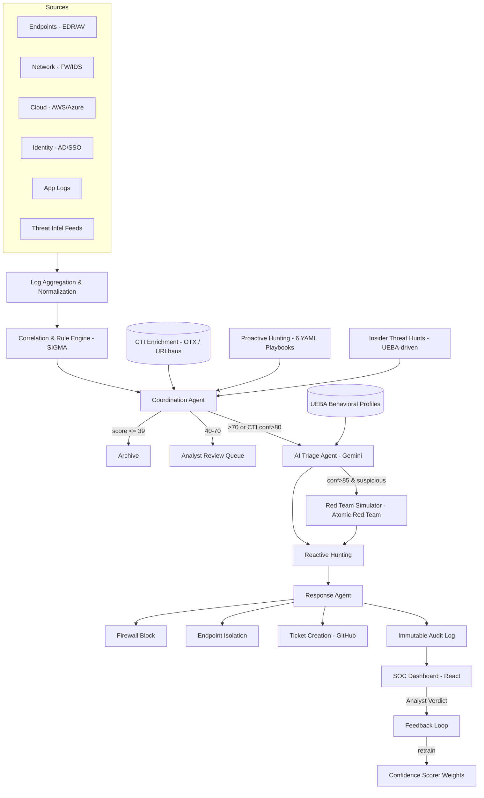

# Agentic SIEM Platform — Cosmic Info Solutions

**A production-oriented SIEM built on Wazuh + Elastic, extended with an agentic AI layer for CTI enrichment, proactive threat hunting, automated response, UEBA/insider-threat detection, red-team validation, and multi-tenant SOC delivery.**

Engineer: **Ahmad Bussti**
Duration: ~10 weeks (Phase 1–4), ongoing
Status: Core detection/response pipeline and multi-tenant API gateway are live and test-verified against a real Elastic/Wazuh stack.

---

## 1. Problem

Off-the-shelf open-source SIEM stacks (Wazuh + ELK) are strong at **collection and correlation** but weak at everything downstream of an alert:

- Analysts triage every alert manually — no automated first-pass verdict, no threat-actor context, no confidence scoring beyond a static rule severity.
- Detection is purely reactive — nothing looks for threats that never tripped a correlation rule.
- "Response" means an analyst manually blocking an IP or isolating a host — no auditable, reversible automation exists.
- There is no way to validate whether a detected technique is *actually exploitable* in the environment, versus just theoretically dangerous.
- None of this scales to more than one client without real tenant isolation, RBAC, and a compliance story.

This project builds that missing layer on top of a real Wazuh/Elastic deployment, as if standing up an MSSP-grade detection-and-response product for a paying security services client.

---

## 2. Solution Summary

A LangGraph-orchestrated agent pipeline sits between Wazuh's correlation output and the analyst. Every alert is:

1. **Enriched** against live threat-intel feeds (IOC match, actor profile, campaign/TTP context)
2. **Scored** by a transparent, additive confidence model (not a black box)
3. **Triaged** by an LLM agent that reasons over CTI, UEBA behavioral deviation, and traffic-volume context
4. **Validated**, when high-confidence, by an automated red-team simulator that tests real exploitability against a disposable target using Atomic Red Team
5. **Responded to** — IP blocks, endpoint isolation, and ticket creation are automated for pre-approved, reversible actions, with full audit logging
6. **Fed back** into a learning loop — analyst verdicts retrain scoring weights

The platform is multi-tenant, gated behind a JWT/RBAC API gateway, and produces compliance evidence (UAE NESA, SOC2, ISO 27001) directly from live operational data rather than static templates.

---

## 3. Architecture



Two independent execution paths exist by design:

- **Reactive path** — alert → coordination → triage → red-team validation → response
- **Proactive path** — scheduled hunts (6h) and UEBA-driven insider-threat hunts (24h) run independently of any triggering alert and escalate into the same triage/response pipeline via a pre-scored synthetic alert

A full interactive architecture diagram is included in this repo (`siem_diagram.html`).

---

## 4. Core Security Capabilities

| Capability | What it does | Status |
|---|---|---|
| **CTI Enrichment** | Every alert checked against 23,937 live IOCs (AlienVault OTX + Abuse.ch URLhaus); confirmed matches pull actor campaigns/TTPs/target sectors into the triage prompt and final summary | Live |
| **Confidence Scoring** | Transparent, additive scorer (base severity + after-hours + new-IP + CTI match + volume + UEBA anomaly) — every point is attributable, not a black box | Live |
| **AI Triage** | LLM agent (Gemini 2.5 Flash) issues verdict/technique/confidence with CTI, UEBA, and volume context folded into the prompt; deterministic actor-profile attachment survives even an LLM outage | Live |
| **UEBA Profiling** | Per-user/host behavioral baselines (login times, source IPs, command patterns, outbound volume, peer group) scored across 5 weighted anomaly dimensions | Live |
| **Proactive Hunting** | 6 YAML-defined hunt playbooks (lateral movement, exfiltration x2, LOLBins, persistence, beaconing) with aggregation-based detection and 7-day behavioral-baseline deviation checks | Live |
| **Insider Threat Detection** | 4 UEBA-driven hunts: credential hoarding, data staging, access broadening, schedule shift — bypasses standard scoring, pre-escalates at 90% confidence | Live |
| **Automated Response** | Wazuh active-response wiring for IP block/unblock and endpoint isolation, with a custom `isolate-host` AR script (default-deny + manager allow-list) built from scratch after confirming Wazuh's stock scripts couldn't do it | Live end-to-end |
| **Red-Team Validation** | Atomic Red Team–backed exploitability testing against a disposable, isolated VM — allowlist-gated, human-reviewed per test GUID, dry-run by default | Live (T1082); T1110/T1059/T1021 gated pending safety review |
| **Attack Chain Simulation** | Multi-step kill-chain templates (external intrusion, credential theft, insider threat) chained through the red-team engine, producing Gemini-generated technical + executive incident reports | Live |
| **Multi-Tenant Isolation** | Index-prefix + document-level `tenant_id` filter enforced twice, independently; hard-fails (never silently degrades) on missing tenant context | Live, verified with real concurrent data on 2+ tenants, 0 leakage |
| **JWT/RBAC API Gateway** | FastAPI gateway, 3-tier RBAC (admin/analyst/viewer), per-role rate limiting, full request audit trail | Live |
| **Tenant Onboarding API** | Self-service tenant creation: index provisioning, API keys, default SIGMA ruleset, agent enrollment tokens | Live |
| **Compliance Reporting** | UAE NESA / SOC2 / ISO 27001 PDF reports generated from live Elastic data, with honest `data_status` flags (no silently-zeroed controls) | Live |
| **Analyst Feedback Loop** | Analyst tp/fp verdicts retrain scorer weights automatically | Live (weight retraining confirmed; wiring into live scoring is a tracked follow-up — see §8) |
| **SOC Dashboard** | Custom React dashboard: live alert feed (WebSocket), MITRE heatmap, confidence distribution, analyst workbench, entity risk timeline, management KPIs | Live |
| **HTTPS Ingestion Gateway** | TLS-enforced external ingestion endpoint with per-tenant API keys and untouched raw staging | Live |

---

## 5. Detection → Investigation → Response Lifecycle

```
1. Log arrives (Wazuh agent → manager → Filebeat → Elasticsearch)
2. Correlation engine fires (SIGMA-style rules, 10 base detections mapped to MITRE ATT&CK)
3. CTI enrichment stamps IOC match / actor / confidence onto the alert
4. Confidence scorer produces a 0–100, fully attributable score
5. Coordination agent routes: archive / analyst review / AI triage
6. Triage agent (LLM) issues verdict + technique + evidence, using CTI + UEBA + volume context
7. If confidence > 85% and suspicious: red-team simulator attempts to validate real
   exploitability against a disposable target (never production)
8. Response agent executes pre-approved, reversible actions (block IP, isolate host,
   open ticket) and logs every attempt — success or failure — to an immutable audit index
9. Alert (and every downstream artifact) is mirrored into the client's isolated tenant index
10. Analyst reviews via the SOC dashboard, records a verdict
11. Verdict feeds the retraining loop, adjusting scorer weights over time
```

Proactive hunts and insider-threat detections enter this same pipeline at step 5, via a pre-scored synthetic alert, whenever a scheduled query independently surfaces a finding.

---

## 6. Agentic AI Layer

Built on **LangGraph**, with a clear separation between the alert-driven graph and a second, independent scheduled-hunt graph:

- **Coordination Agent** — routes alerts by confidence tier; force-routes to triage on high-confidence CTI matches
- **Triage Agent** — LLM-based verdict engine (Gemini 2.5 Flash); assembles CTI, actor-profile, UEBA, and volume context into a structured prompt; falls back to a deterministic actor-profile attachment if the LLM call itself fails
- **Hunting Agent** — dual-mode: reactive (correlates within an already-triggered alert) and proactive (scheduled, alert-independent, YAML-defined playbooks)
- **Response Agent** — decision logic for approved actions, wired to real Wazuh active-response execution
- **Red-Team Simulator** — allowlist-gated, per-technique dispatch onto a disposable target via Atomic Red Team
- **Attack Chain Simulator** — sequences the red-team simulator across a multi-step kill chain
- **UEBA Scorer** — 5-dimension behavioral anomaly scoring, feeds both the confidence scorer and the triage prompt

All LLM calls (triage, hunt summaries, red-team reports, compliance summaries) follow the same convention: never raise, fall back to a templated result on any provider error — a Gemini outage never blocks the pipeline.

---

## 7. My Engineering Contributions

This was a solo build across the full stack — not a config exercise on top of a vendor product. Representative examples:

- **Diagnosed and worked around a real Wazuh platform limitation**: the Wazuh REST API has no way to send a "delete" action to a stateful active-response script (confirmed against Wazuh's own GitHub issue tracker). Designed and shipped an SSH-based reversal path that replicates the script's internal STDIN contract, for both IP blocking and endpoint isolation.
- **Designed and implemented a custom active-response script** (`isolate-host`) from first principles — a dedicated iptables chain with a manager allow-list and default-deny, since Wazuh's stock `firewall-drop` can only block, not selectively isolate.
- **Built the multi-tenant isolation model** with two independent, defense-in-depth enforcement layers (index-prefix + document filter), verified under adversarial live conditions (real, concurrent data on two tenants, confirmed zero cross-tenant leakage rather than an empty-store false positive).
- **Applied a safety-first, human-in-the-loop review discipline for red-team automation**: reviewed the actual Atomic Red Team test YAMLs before approving any technique, rejecting an entire test family (T1110.001 sudo brute-force) because it executed an unpinned `curl | bash` from a live GitHub branch — a real supply-chain risk independent of the red-team framing.
- **Root-caused and fixed 4 distinct live UEBA data-quality bugs** that a mocked test suite could not catch (per-user query scoping, decorated-vs-plain username matching across rule types, a string-vs-numeric aggregation bucket-key crash, and silent zero/absent-field ambiguity) — replacing every silent zero with an honest coverage flag.
- **Identified a subtle triage-quality gap**: sparse UEBA profiles (e.g. new hires) scoring 0/100 on unpopulated dimensions were being read by the LLM as "confirmed normal," which downgraded a real 45x-baseline insider-threat finding from suspicious to benign — flagged and tracked as a priority fix, exactly the population where insider-threat detection matters most.
- **Enforced a transparent, additive scoring philosophy end-to-end** — confidence scores, UEBA risk scores, and compliance-control scores are all built from named, inspectable rules rather than an opaque model, and every compliance control reports an honest `data_status` (ok / no_data / query_failed / not_tracked) instead of a silently misleading zero.
- **Delivered the full API/security-gateway layer**: JWT auth, 3-tier RBAC, per-role rate limiting, tenant-scoped reads enforced structurally (not per-route policy), and a self-service tenant-onboarding flow.
- **Stood up a TLS-only external ingestion gateway** (Caddy + FastAPI) with per-tenant, revocable API keys and untouched raw-payload staging, diagnosing real infrastructure issues along the way (port conflicts with an existing Wazuh dashboard container, systemd `PATH` resolution, and a TLS handshake failure traced to a hostname-less Caddy site block).

---

## 8. Known Limitations (Reported Honestly)

A real project has open edges. These are tracked, not hidden:

- Retrained confidence weights are computed and audited but **not yet consumed** by the live scorer — confirmed via a live before/after replay showing an unchanged score (tracked P1).
- Endpoint isolation and several red-team techniques (T1110, T1059, T1021) remain **deliberately gated** pending further safety review or a domain-joined test environment — nothing here executes live without an explicitly reviewed and allowlisted test.
- Kibana drilldowns are unavailable on the Basic license tier; native click-to-filter is used as the documented substitute.
- Webhook delivery logging has a known Elasticsearch field-mapping conflict that currently causes a successfully-delivered notification to be mis-logged as failed — external delivery was independently confirmed (Slack payload observed via webhook.site) while the root cause is scheduled for the next hardening pass.
- TLS on the external ingestion gateway currently uses a locally-trusted internal CA, pending a public domain and DNS.

---

## 9. Tech Stack

**Detection & Storage:** Wazuh, Elasticsearch, Kibana, Filebeat
**Orchestration:** LangGraph, Python, APScheduler
**AI/LLM:** Gemini 2.5 Flash (`google-genai`)
**API/Auth:** FastAPI, JWT (`python-jose`), `passlib`/bcrypt, `slowapi`
**Frontend:** React (Vite), Recharts, WebSockets
**Red-Team Tooling:** Atomic Red Team, PowerShell remoting (SSH)
**Compliance:** ReportLab, Matplotlib
**Infra:** Docker Compose, Caddy (TLS), systemd

---

## 10. Repository Contents

- `siem_diagram.html` — interactive architecture diagram (agentic layer highlighted vs. the original correlation pipeline)
- `project.md` — full engineering log: architecture, index schemas, agent logic, every live test run and bug fix across all phases
- `phase2-test-results.md`, `phase2-completion-report.md` — Phase 2 (CTI/hunting/response) scenario testing and sign-off
- `day41-redteam-simulator.md` — red-team engine design, safety model, and live execution log
- `day54-tenant-onboarding.md` — multi-tenant onboarding API build log
- `day58-analyst-workbench.md` — SOC dashboard analyst workbench build log
- `day1-ingestion-gateway.md` — external HTTPS ingestion gateway build log

---

*This repository documents an ongoing engineering effort for Cosmic Info Solutions. All test results, confidence figures, and bug reports above reflect real runs against a live Wazuh/Elasticsearch stack, not simulated or projected figures.*
